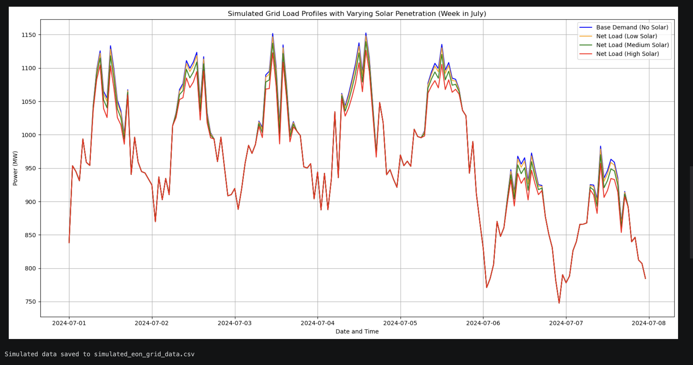

# Solar Grid Impact Analyzer  
### Strategic Peak-Shaving, Battery Dispatch, and ROI Optimization for Solar-Integrated Energy Systems


---


## Overview

**Solar Grid Impact Analyzer** is a data-driven energy analytics project designed to evaluate how solar generation, battery storage, and electricity pricing interact in a grid-connected environment.

The project focuses on a real operational challenge in the energy sector:  
when solar production is high, market prices can be low, and when demand spikes in the evening, solar output drops. This creates the well-known **Duck Curve** problem.

This analyzer helps answer a key business question:

> **Should energy be sold to the grid now, stored in a battery, or used internally later to reduce peak-hour costs?**

Using time-series analysis, forecasting, and battery dispatch logic, this project identifies opportunities to reduce operating cost, improve energy utilization, and strengthen the financial case for battery energy storage systems (BESS).

---

## Business Problem

Industrial and commercial energy consumers often face:

- High evening grid tariffs
- Underutilized solar generation
- Poor timing between generation and demand
- Limited visibility into battery dispatch strategy
- Difficulty proving ROI for energy storage investments

Without optimization, a solar-connected system may:

- export power when prices are weak
- buy back expensive grid power during sunset demand peaks
- lose arbitrage value
- reduce the financial return of solar + battery infrastructure

This project was built to quantify and solve that problem.

---

## Project Objectives

The main objectives of this project are to:

- Analyze solar yield against energy price behavior
- Detect peak-cost windows and grid dependency risks
- Build logic for **sell vs. store** battery decisions
- Forecast solar production using regression models
- Estimate carbon reduction and business ROI
- Visualize profitability across price, yield, and battery state

---

## Scope and Limitations

This is an independent portfolio project using simulated energy data. It explores solar generation, electricity prices and battery dispatch scenarios.

Cost savings, carbon reductions and investment payback are modeled estimates, not measured customer outcomes. They depend on the input data and assumptions.

Forecasting performance should be evaluated on a chronological holdout set and compared with a baseline before drawing conclusions about real-world performance.


---

## Why This Project Matters

This project is relevant to real-world problems in:

- Renewable energy integration
- Smart grid analytics
- Battery energy storage optimization
- Industrial energy cost reduction
- Carbon-aware operational planning
- Energy investment decision support

It demonstrates how analytics can move beyond reporting and into **operational strategy**.

---

## Technical Scope

### Core Technologies
- **Python**
  - Pandas
  - NumPy
  - Scikit-learn
  - Plotly / Matplotlib
- **SQL**
  - Window functions
  - Rolling metrics
  - anomaly detection logic
- **Machine Learning**
  - Linear Regression
  - Polynomial Regression
- **Visualization**
  - Dashboarding
  - Multi-variable profitability analysis
  - 3D surface exploration

---

## Analytical Workflow

### 1. Data Collection
The project aligns and analyzes:

- solar generation data
- weather conditions
- market/grid price telemetry
- battery state indicators
- demand/load behavior

### 2. Data Preparation
- Time-series cleaning
- Timestamp alignment
- Missing-value handling
- Feature engineering
- Rolling averages and volatility calculations

### 3. Cost & Dispatch Analysis
- Peak-hour identification
- Price spread analysis
- Sunset demand-gap detection
- Battery charge/discharge opportunity mapping

### 4. Forecasting
Regression models are used to estimate short-term solar output and support decision-making around storage and dispatch.

### 5. ROI & Sustainability Modeling
The project estimates:

- avoided grid purchase cost
- storage value capture
- carbon offset impact
- investment payback horizon

---

## System Logic

The project follows a simple but high-value operational idea:

### Decision Engine
At each decision point:

- If solar generation is high and prices are low → **store energy**
- If battery is charged and grid prices are high → **discharge battery**
- If internal demand is high during sunset → **prioritize self-consumption**
- If market conditions are favorable → **sell energy strategically**

This supports a more profitable and resilient solar-grid operation.

---

## Project Architecture

```text
Solar + Weather + Grid Price Data
                │
                ▼
        Data Cleaning & Alignment
                │
                ▼
      Feature Engineering / SQL Metrics
                │
                ▼
   Peak Detection + Forecasting Models
                │
                ▼
   Sell vs Store Battery Dispatch Logic
                │
                ▼
 Cost Savings / Carbon Offset / ROI Dashboard
```

---

## Project Structure

Solar-Grid-Impact-Analyzer/
├── 1_Simulate_Energy_Data.ipynb
├── 2_EDA_Pre_processing.ipynb
├── 3_Feature_Engineering_Model_Training.ipynb
├── 4_Deployment_App.html
├── simulated_eon_grid_data.csv
├── weather_data_fetcher_py.ipynb
├── sql/
│   └── solar_grid_kpi_analysis.sql
├── simple_server.py
├── dashboard.png
├── requirements.txt
└── README.md

---

##  Dashboard


